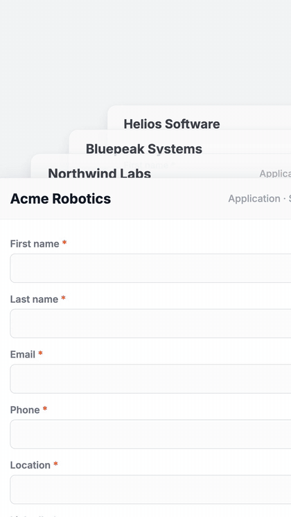
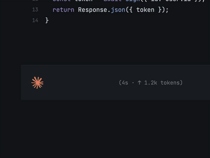

# Remotion Motion Graphics Skill

Agent skills for making clean, modern motion-graphics B-roll with [Remotion](https://remotion.dev) — the kind of animated inserts used in AI education videos: workflow diagrams, kinetic text, UI mockups, product demos, and cinematic camera moves through a single continuous scene.

These skills were battle-tested by [Promptible](https://promptible.io) producing short-form and long-form AI content. Every example below was generated by an AI agent (Claude) following these skill files.

## Examples

All three clips were built entirely in Remotion/React by an agent using these skills. Click any preview for the full-quality MP4.

<table>
  <tr>
    <td align="center" width="33%">
      <a href="examples/openmontage-hook.mp4"></a>
      <br/><sub><b>Logo-driven hook</b> — continuous camera movement</sub>
    </td>
    <td align="center" width="33%">
      <a href="examples/tsenta-apply-faster.mp4"></a>
      <br/><sub><b>Old way vs AI way</b> — comparison with real product UI</sub>
    </td>
    <td align="center" width="33%">
      <a href="examples/kickbacks-same-run-editor.mp4"></a>
      <br/><sub><b>Product workflow demo</b> — one continuous camera world</sub>
    </td>
  </tr>
</table>

## What's inside

Two skill files, designed to be used together and alongside the [official Remotion skill](https://github.com/remotion-dev/skills):

- **[`skills/motion-graphics/SKILL.md`](skills/motion-graphics/SKILL.md)** — the taste layer: visual language, color system, spring presets, kinetic text patterns, AI workflow diagram patterns, chart rules, mobile readability minimums, and a hard rule against redundant on-screen text (never restate the voiceover).
- **[`skills/cinematic-camera/SKILL.md`](skills/cinematic-camera/SKILL.md)** — the movement layer: build one continuous scene larger than the viewport and drive a keyframed camera through it (hold → move → hold), plus an approved-reference review gate and delivery QA checklist.

## How to use

These are [Agent Skills](https://agentskills.io) — markdown instruction files that AI coding agents (Claude Code, etc.) read before working.

1. Set up a Remotion project (`npx create-video@latest`).
2. Clone the official Remotion skill for API correctness:
   ```bash
   git clone https://github.com/remotion-dev/skills vendor/remotion-skills
   ```
3. Copy this repo's `skills/` folders into your agent's skills directory (e.g. `.claude/skills/` or `.agents/skills/`).
4. Ask your agent for a graphic, e.g.:
   > Build a 6-second 1080x1920 clip: a project brief card slides into a product logo, which then bursts into finished assets around it. Use the motion-graphics and cinematic-camera skills.
5. Preview with `npx remotion studio`, render with `npx remotion render <CompositionId> out/clip.mp4`.

## Principles (the short version)

- The graphic must make the point understandable in **under 2 seconds**.
- **Never restate the voiceover on screen** — captions already do that. Real data (numbers, UI text, code) is fine; narrated phrases are not.
- Clarity → retention → polish → reusability, in that order.
- One continuous world + a moving camera beats disconnected panels in a void.
- Real logos and screenshots beat invented placeholder UI.
- All motion driven by `useCurrentFrame()` / `spring()` / `interpolate()` — never CSS animations.
- Every clip ends with a clean hold so editors can cut.

## License

MIT — use it, remix it, ship it.
