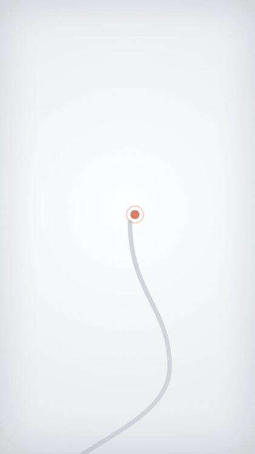
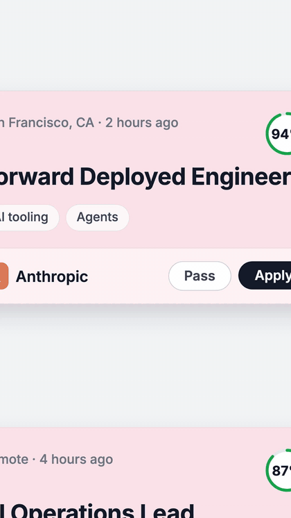
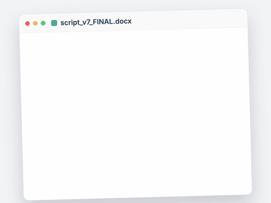
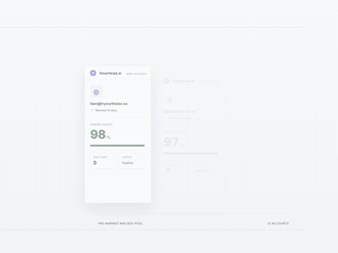

<div align="center">

# Remotion Motion Graphics Skills

**Teach your AI coding agent to produce broadcast-quality motion graphics with [Remotion](https://remotion.dev).**

Kinetic text · AI workflow diagrams · cinematic camera moves · terminal demos · editorial highlights

[](https://skills.sh/liamrjohnston/remotion-motion-graphics-skill)
[](LICENSE)
[](https://remotion.dev)

```bash
npx skills add liamrjohnston/remotion-motion-graphics-skill
```

Works with **Claude Code**, **Codex**, **Cursor**, **OpenCode**, and 60+ other agents.

</div>

---

## What is this?

Four [Agent Skills](https://agentskills.io) that turn an AI coding agent into a motion-graphics artist. Point your agent at a script line or product idea, and it first confirms the delivery format and background surface, then builds a finished, editor-ready Remotion clip — timed, choreographed, QA'd, and rendered.

These skills were developed in production at [Promptible](https://promptible.io), where every graphic below was **built entirely by an AI agent** following these instructions — no human touched the code or the keyframes.

## Mandatory intake before every build

The agent must ask for any choice your prompt did not already specify:

1. **Format**
   - **4:3 — 1440×1080:** half-screen Instagram insert / over A-roll.
   - **9:16 — 1080×1920:** full-screen Instagram/Reels/TikTok.
2. **Background**
   - Warm light.
   - Clean dark.
   - Light grid.
   - Dark grid.

If you delegate the choice, the locked fallback is warm light. The skills prohibit silently defaulting to a dark canvas.

## Zero-neon production policy

Every skill enforces the same hard ban: **no neon, glow, bloom, luminous edges, colored shadows, cyan-purple gradients, gradient orbs, radial color washes, glassmorphism, cyberpunk lighting, or generic vibe-coded AI/SaaS styling.**

Dark and dark-grid scenes use restrained neutral charcoal surfaces with flat product accents — never glowing panels. If a prohibited treatment appears in a QA still, the agent must remove it and revise privately before showing the render.

## Examples

Every clip in this gallery was generated by Claude following these skills. Click any preview for the full-quality MP4.

### Vertical short-form (1080×1920)

<table>
  <tr>
    <td align="center" width="20%">
      <a href="examples/openmontage-hook.mp4"></a>
      <br/><sub><b>Logo-driven hook</b><br/>Brand mark absorbs a project brief, then bursts into finished assets</sub>
    </td>
    <td align="center" width="20%">
      <a href="examples/openmontage-claude-pipeline.mp4"></a>
      <br/><sub><b>Agent pipeline</b><br/>Claude-driven build pipeline traversed by a continuous camera</sub>
    </td>
    <td align="center" width="20%">
      <a href="examples/tsenta-apply-faster.mp4"></a>
      <br/><sub><b>Old way vs AI way</b><br/>Manual drudgery vs rapid automation, hours vs seconds</sub>
    </td>
    <td align="center" width="20%">
      <a href="examples/tsenta-one-click-wall.mp4"></a>
      <br/><sub><b>One-click payoff</b><br/>A single action fans out into a wall of results</sub>
    </td>
    <td align="center" width="20%">
      <a href="examples/kickbacks-spinner-terminals.mp4"></a>
      <br/><sub><b>Parallel agent terminals</b><br/>Concurrent CLI sessions working in one shared world</sub>
    </td>
  </tr>
</table>

### Horizontal / insert format (1440×1080)

<table>
  <tr>
    <td align="center" width="25%">
      <a href="examples/kickbacks-same-run-editor.mp4"></a>
      <br/><sub><b>Product workflow demo</b><br/>Editor UI recreation inside one camera world</sub>
    </td>
    <td align="center" width="25%">
      <a href="examples/openmontage-tool-chaos.mp4"></a>
      <br/><sub><b>Tool-chaos comparison</b><br/>Scattered tool sprawl collapsing into one system</sub>
    </td>
    <td align="center" width="25%">
      <a href="examples/smartlead-prewarmed-burn.mp4"></a>
      <br/><sub><b>Cinematic product story</b><br/>Slow camera push through a real-data product narrative</sub>
    </td>
    <td align="center" width="25%">
      <a href="skills/article-highlights/assets/examples/article-highlight.mp4"></a>
      <br/><sub><b>Article highlight</b><br/>Editorial card with hand-drawn marker strokes behind key phrases</sub>
    </td>
  </tr>
</table>

## The skills

| Skill | Layer | What it teaches the agent |
| --- | --- | --- |
| [`motion-graphics`](skills/motion-graphics/SKILL.md) | Taste | Visual language, color system, spring presets, kinetic text patterns, diagram archetypes, chart rules, mobile readability minimums |
| [`cinematic-camera`](skills/cinematic-camera/SKILL.md) | Movement | One continuous world + a keyframed camera rig, choreography grammar, reference-review gate, delivery QA |
| [`terminal-inserts`](skills/terminal-inserts/SKILL.md) | Format | Authentic CLI/terminal demos — installs, agent run logs, generated-output cards — with real terminal symbols and 3D window motion |
| [`article-highlights`](skills/article-highlights/SKILL.md) | Format | Editorial/news-style cards with layered rough.js highlighter strokes, blur-in, and subtle 3D rotation |

### `motion-graphics` — the enforced production gate

The foundation now ships as an executable, fail-closed workflow—not taste advice the agent can skim. Before code, `scripts/promptible-gate.mjs` verifies the bundled approved references by SHA-256, requires written reference observations, and issues `BUILD AUTHORIZED`. Named-product work also requires authentic identity plus at least one real local product asset. After rendering, the gate hashes the candidate MP4, contact sheet, and probe evidence; only a separate critic can issue the scores needed for `DELIVERY AUTHORIZED`.

The skill owns mandatory format/background intake, approved-reference review, mobile readability, restrained material recipes, concept selection, and the repository-wide zero-neon/zero-glow policy. It includes the single most important text rule in the system:

> **Never restate the voiceover on screen.** Narrated videos already have captions. Real data — counters, dollar amounts, percentages, UI text, code — belongs on screen; narrated phrases do not. If a beat feels empty, the fix is a better graphic, not added text.

### `cinematic-camera` — the movement layer

What separates these clips from typical template motion graphics. Instead of panels popping in and out of a void, the agent builds **one continuous scene larger than the viewport** and drives a keyframed camera through it: open tight on an action, hold while it completes, reveal the larger system, whip-pan to the payoff, settle for a clean cut. Includes the exact camera-rig code (shared keyframe timeline for focal point + zoom) and a mandatory reference-review gate so every new clip continues an established visual system instead of reinventing one.

### `terminal-inserts` — authentic CLI demos

For Claude Code / Codex / MCP / agent content. Enforces real terminal structure (`~ $` prompts, character-by-character typing, `◇` progress rows, trailing `✓`, blinking cursor, ASCII hero words) and bans the fake stuff (checkbox UI, emoji, status chips, dashboard cards inside a terminal). Windows enter with 3D perspective tilt like a floating screen. Ships with two reference renders and contact sheets in [`assets/`](skills/terminal-inserts/assets/examples/) and [`references/`](skills/terminal-inserts/references/).

### `article-highlights` — editorial proof

For news/release/trend beats where a terminal would feel forced. Builds layered DOM/SVG article cards — paper, rough.js marker strokes, then text — so highlights draw on *behind* the words like a real highlighter, with blur-in and a slow 3D push. Ships with the approved reference render in [`assets/examples/`](skills/article-highlights/assets/examples/).

## Install

### Don't have Remotion yet? Full setup in one command

Scaffolds a fresh Remotion project **and** installs all the skills (this repo's four + the official Remotion skill) in one go:

```bash
curl -fsSL https://raw.githubusercontent.com/Liamrjohnston/remotion-motion-graphics-skill/main/install.sh | bash
```

Pass a project name if you want: `... | bash -s -- my-project`. Run it inside an existing Remotion project and it skips scaffolding and just installs the skills. Cloned this repo instead? Same thing: `bash install.sh`. ([Read the script](install.sh) — it's ~50 lines: `create-video` + `skills add`, nothing else.)

### Already have a project? Just add the skills

**One command, from any terminal:**

```bash
npx skills add liamrjohnston/remotion-motion-graphics-skill
```

The [skills CLI](https://github.com/vercel-labs/skills) detects your agent (Claude Code, Codex, Cursor, OpenCode, and [60+ more](https://github.com/vercel-labs/skills#supported-agents)) and installs all four skills into the right directory. Useful variants:

```bash
# Install globally (available in every project)
npx skills add liamrjohnston/remotion-motion-graphics-skill -g

# Claude Code only, no prompts
npx skills add liamrjohnston/remotion-motion-graphics-skill -a claude-code -y

# Just one skill
npx skills add liamrjohnston/remotion-motion-graphics-skill --skill cinematic-camera
```

<details>
<summary><b>Manual install</b></summary>

Clone and copy the skill folders into your agent's skills directory:

```bash
git clone https://github.com/liamrjohnston/remotion-motion-graphics-skill
cp -r remotion-motion-graphics-skill/skills/* .claude/skills/   # Claude Code (project)
# or ~/.claude/skills/ for global; .agents/skills/ for other agents
```

</details>

**Recommended companion:** the official Remotion skill for API correctness — these skills provide taste and choreography on top of it.

```bash
npx skills add remotion-dev/skills
```

## Quick start

1. Create a Remotion project and install the skills:

   ```bash
   npx create-video@latest my-graphics
   cd my-graphics
   npx skills add liamrjohnston/remotion-motion-graphics-skill -y
   npx skills add remotion-dev/skills -y
   ```

2. Ask your agent for a graphic. A good prompt names the script beat, format, and duration:

   > Build a 6-second 1080x1920 clip for this script line: "You give it the actual project, and it builds the finished assets around it." A project-brief card slides into the product logo, the logo absorbs it with a pulse, then finished asset cards burst outward and settle. Use the motion-graphics and cinematic-camera skills.

3. Preview and render:

   ```bash
   npx remotion studio
   npx remotion render <CompositionId> out/clip.mp4
   ```

The agent handles the rest: it verifies and reviews the bundled reference material, writes a beat map, builds the scene, typechecks, renders QA evidence, and submits that evidence to an independent critic. A failed or incomplete gate cannot be delivered.

**Want to see what real prompting looks like?** Read **[docs/prompt-threads.md](docs/prompt-threads.md)** — condensed threads from real production sessions showing the request, reference review, build, QA, and revision loop behind four examples. The current skills require agents to run that rejection loop privately so the first render shown to the user already clears the production bar.

## How the system works

The four skills form a pipeline the agent walks through on every request:

1. **Mandatory intake** — ask 4:3 half-screen vs 9:16 full-screen, then warm light vs clean dark vs light grid vs dark grid before writing code.
2. **Executable reference preflight** — verify six bundled approved MP4s/contact sheets by hash, require real assets for named products, and record concrete observations before the gate permits coding.
3. **Build** — use real product identity and a mechanism drawn from the references; no receipt, invoice, dossier, clipboard, barcode, stamp, certificate, pricing-card, or generic dashboard fallback.
4. **Candidate evidence** — hash the rendered MP4, contact sheet, and `ffprobe` metadata, then lock them while review is pending.
5. **Independent visual critic** — a separate reviewer scores reference fidelity, composition, identity, legibility, motion, restraint, and edit usefulness. Any hard failure, any score below 8, or an average below 8.5 rejects delivery.
6. **Delivery authorization** — only evidence that passes the executable gate can be shown as the finished render.

## Principles

- **Under 2 seconds to comprehension.** If the viewer can't parse it instantly, it fails.
- **Choose format and surface before coding.** Never invent the canvas or silently default to dark.
- **Zero neon and zero glow.** No gradient-orb, glass-card, cyan-purple, cyberpunk, or vibe-coded AI styling.
- **Motion explains, never decorates.** The camera moves to the action; data flows in the direction of causality.
- **Never restate the voiceover.** Captions already do that job.
- **Real assets over invented UI.** Actual logos, screenshots, and recordings — never colored-square placeholders.
- **Clarity → retention → polish → reusability**, in that order.
- **Every clip ends in a clean hold** so an editor can cut anywhere.
- **Mobile-first readability.** ~64px headline minimum on vertical; nothing critical near platform UI zones.

## Repository structure

```
docs/
└── prompt-threads.md     # Real request → feedback → revision threads
skills/
├── motion-graphics/      # Enforced taste/reference/critic gate + bundled references
├── cinematic-camera/     # Movement layer: camera rig + choreography
├── terminal-inserts/     # CLI/terminal demo format (+ reference renders)
└── article-highlights/   # Editorial/news highlight format
examples/                 # Finished agent-built renders (MP4)
previews/                 # Animated GIF previews used in this README
```

## FAQ

**Do I need to know Remotion?** No — the agent writes all the code. Knowing React helps if you want to hand-tune output.

**Which agent works best?** Developed and tested with Claude Code, but the skills are plain markdown in the open [Agent Skills](https://agentskills.io) format — any supporting agent can use them.

**Can I use these commercially?** Yes — MIT licensed. The example videos are provided for demonstration; product names and logos shown belong to their respective owners.

## License

[MIT](LICENSE) — use it, remix it, ship it.

---

<div align="center">
<sub>Built and battle-tested by <a href="https://promptible.io">Promptible</a> · Powered by <a href="https://remotion.dev">Remotion</a></sub>
</div>
